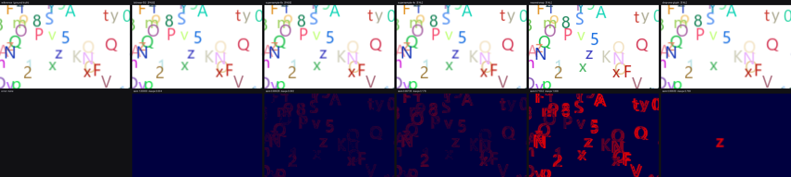

# RenderBench-mini

A benchmark and multi-agent loop for **LLMs writing GPU rendering kernels** — a scaled-down, working implementation of a larger research plan targeting 8 tasks, datacenter Triton, and an 8-week schedule. This is the part that runs today, on one laptop, in under a minute, built to prove the methodology before the model spend starts.

```bash
python calibrate_thresholds.py   # gate: do the oracle thresholds actually work?
python run_bench.py              # 6 tasks, agent loop, offline replay (no API key needed)
python gpu_track.py              # the same tasks as real Triton kernels
python make_figures.py           # figures for the writeup
```

`run_bench.py --provider live` switches the same loop onto a real model (GLM-5.3 or Claude, see [Live mode](#live-mode)).

## Contents

- [Status](#status)
- [Results](#results) — [CPU track](#cpu-track) · [GPU track](#gpu-track) · [Live mode](#live-mode)
- [Methodology](#methodology) — [why SSIM alone fails](#the-perceptual-oracle-is-not-ssim) · [anti-reward-hacking](#anti-reward-hacking)
- [Architecture](#architecture)
- [Honest limits](#honest-limits)
- [Roadmap](#roadmap)

## Status

| Component | Status |
|---|---|
| Task specs | 6 of 8 (descope ladder drops `atlas_lookup`, `tiled_multipage_pack`) |
| Correctness oracles | exact / tolerance / perceptual — all three in use |
| Threshold calibration | run before every result; blocks the runner if it fails |
| Judge | subprocess-isolated, frozen, source-screened |
| Timing methodology | warmup + median-of-N + IQR + CV, declared per task |
| Coder→judge→advisor→coder loop | working, round-capped, fully logged |
| Baselines: naive / single-agent / coder+advisor | naive ✅ · coder+advisor ✅ (live, 2 models) · single-agent not yet run live |
| Triton kernels on real hardware | ✅ RTX 5060, sm_120 |
| Gate 0 (Glyph render-vs-encode profile) | not started |
| Expert baseline (Slug) | not started |

## Results

### CPU track

Offline replay (no model call) — 6/6 solved, geomean **3.22x** over the naive reference.

| Task | Oracle | First pass | Naive | Best | Speedup |
|---|---|---|---|---|---|
| `blit` | exact | round 1 | 12.19 ms | 0.94 ms | **13.01x** |
| `alpha_composite` | exact | round 1 | 69.14 ms | 24.52 ms | **2.82x** |
| `srgb_gamma` | tolerance | round 1 | 85.07 ms | 19.20 ms | **4.43x** |
| `bilinear_resize` | tolerance | round 1 | 145.28 ms | 55.70 ms | **2.61x** |
| `glyph_atlas_blit` | perceptual | round 1 | 45.39 ms | 27.66 ms | **1.64x** |
| `text_page_raster` | perceptual | round 1 | 182.81 ms | 114.51 ms | **1.60x** |

The gradient is the thesis in miniature: elementwise, exactly-checkable tasks give up 2.6–13x, while the two order-constrained glyph tasks — the ones that are actually *rendering* — give up ~1.6x. Speedups fall off exactly where the task stops resembling a math kernel.

> **Run-to-run variance is real at this scale.** An immediate repeat from a cleared cache gave geomean 3.11x instead of 3.22x, with per-task speedups moving up to 0.23x. Read these as "roughly this shape," not precise measurements — multi-seed aggregation is still needed.

### GPU track

Real Triton kernels on an RTX 5060 (sm_120), scored by the same frozen oracles as the CPU track.

Two numbers per kernel:
- **Kernel-only** — launch timing with inputs already resident on the GPU, output left there. What a fused pipeline stage would see.
- **End-to-end** — host array in, kernel, host array out, every call. What calling this kernel from CPU-resident code actually costs, transfer included.

| Kernel | Oracle | Naive CPU | Kernel-only | End-to-end (honest) |
|---|---|---|---|---|
| `alpha_composite` | exact, bit-identical | 65.94 ms | 0.051 ms → 1283x | 1.337 ms → **49x** |
| `glyph_atlas_blit` TILE=16 | perceptual, pass | 43.83 ms | 0.424 ms → 103x | 1.205 ms → 36x |
| `glyph_atlas_blit` TILE=32 | perceptual, pass | 43.83 ms | 0.164 ms → 268x | 0.932 ms → 47x |
| `glyph_atlas_blit` TILE=64 | perceptual, pass | 43.83 ms | 0.148 ms → 296x | 0.723 ms → **61x** |

Geomean: kernel-only 320x, **end-to-end 47.5x**. For an op this cheap, PCIe transfer dominates — `alpha_composite`'s transfer overhead alone (1.29 ms) is 25x its own compute time. The end-to-end number is the one to quote; an earlier version of this table reported kernel-only as if it were end-to-end and overstated `alpha_composite` by 25x (1593x vs. 63x measured honestly). `gpu_track.py` now reports both, always.

Source-over blending is not associative, so glyphs must apply in submission order — ruling out a one-thread-per-glyph scatter. The kernel is a **tiled rasterizer**: each program owns an output tile and walks the glyph list in order, scalar-rejecting glyphs whose box misses that tile.

### Live mode

The same loop run against two real models, real API calls, real dollars.

**GLM-5.3-free** (aggregator free tier) — `blit` solved end to end: the coder wrote a correct clipped blit, the advisor gave an implementation-level critique ("the double-copy reads then immediately overwrites the intersection"), the revision followed it and introduced a real bug (dropped `import numpy`), and the judge caught it. **11.5x speedup, $0.05.**

The wider 6-task run mostly failed — not from model weakness, but two harness bugs since fixed:
- This reasoning model can spend its entire `max_tokens` budget on hidden `reasoning_content` before writing visible code (one call: 6,613 completion tokens → 254 characters of kernel)
- The revise-round prompt didn't say "return the complete file, not a diff," so a revision could silently drop an earlier import

(The free endpoint's own instability — one calibration call ran ~200 minutes before timing out — is not fixable from this side, but every live call now has a hard wall-clock deadline regardless of cause.)

**Claude Opus 5** (`api.anthropic.com`, real paid usage) — **4/6 solved, geomean 4.27x, $0.76 spent.**

| Task | Result | Speedup |
|---|---|---|
| `blit` | solved | 15.95x |
| `alpha_composite` | solved | 2.10x |
| `srgb_gamma` | solved | 2.53x |
| `bilinear_resize` | solved | 3.91x |
| `glyph_atlas_blit` | real bug | — |
| `text_page_raster` | untested | account ran out of credit mid-run |

The one real failure is the interesting result: Opus wrote a sophisticated `glyph_atlas_blit` kernel — in-place buffer reuse, no per-glyph allocation, correct four-tap bilinear structure — but sized its output write as `(gh+1, gw+1)` instead of `(gh, gw)`, bleeding coverage one row and column past each glyph's box. **The identical failure class as the Triton bug found earlier in this project**, caught the same way: invisible to SSIM (near 1.0 on passing cases), caught by the bounded per-pixel cap. Same bug, two independent code generators, one oracle.

**Configuration:**

```bash
export RB_API_KEY=...            # or a .env file next to run_bench.py
export RB_MODEL=glm-5.3          # pinned; logged into every run summary
export RB_BASE_URL=...           # omit for GLM-5.3's default; api.anthropic.com/v1 for Claude
export RB_BUDGET_USD=5.00        # hard cap, checked before each call
python run_bench.py --provider live --rounds 5
```

Auto-detects an OpenAI-compatible `/chat/completions` backend or Anthropic's native `/messages` API from `RB_BASE_URL`. Every call is capped by a wall-clock deadline (default 240s) across all retries — `requests`' own `timeout=` only bounds the gap between bytes, not the call as a whole.

## Methodology

### The perceptual oracle is not SSIM

Anti-aliased coverage at a fractional offset has no bit-reproducible answer, so the glyph tasks need tolerance rather than an exact match. The obvious choice is an SSIM floor. It doesn't work, and calibration measured exactly how badly:

| Probe | Verdict | SSIM | Max pixel err |
|---|---|---|---|
| `bilinear-f32` | must pass | 1.00000 | 0.004 |
| `supersample-8x` | must pass | **0.99928** | 0.082 |
| `supersample-4x` | must fail | 0.99730 | 0.176 |
| `nearest-snap` | must fail | 0.71552 | 1.000 |
| `drop-one-glyph` | must fail | **0.99930** | 0.769 |

A renderer that **silently drops a glyph** scores 0.99930 — *higher* than a valid supersampled implementation at 0.99928. SSIM doesn't just fail to separate them; it ranks them backwards. For a vision-text-compression pipeline this is the worst possible failure mode, since the text is the entire payload.

The oracle is therefore a conjunction — **SSIM floor ∧ bounded worst pixel ∧ bounded bad-pixel fraction** — and the per-pixel cap is what actually catches the dropped glyph.



*Top row: the render. Bottom row: the error map. `drop-one-glyph` looks identical to the reference by eye — its single red `z` is the whole defect.*

**The thresholds aren't hand-tuned until things pass.** They're fitted to a stated rule — *an implementation passes if it resolves sub-pixel phase to 1/8px or finer and loses no coverage* — and `calibrate_thresholds.py` verifies the rule separates all five probes:

| Supersample | Phase | SSIM | Max px err |
|---|---|---|---|
| 2x | 1/2 px | 0.98953 | 0.326 |
| 4x | 1/4 px | 0.99730 | 0.176 |
| 8x | 1/8 px | 0.99928 | 0.082 |
| 16x | 1/16 px | 0.99980 | 0.039 |

`run_bench.py` refuses to run if calibration fails to separate the probes; `--force-uncalibrated` overrides this and stamps the run as unreportable.

**The oracle earned its keep immediately.** The first Triton glyph rasterizer scored SSIM 0.99999 and was still wrong — it bled coverage one row above and one column left of each glyph's box (unbounded bilinear taps), ~36 code values of error on boundary pixels. Invisible to the structural floor, caught by the per-pixel cap. Same failure mode as `drop-one-glyph`, found in real code within an hour of the oracle existing.

### Anti-reward-hacking

The judge is frozen once working and defended against the failure modes that broke prior kernel-agent benchmarks (see: Sakana AI CUDA Engineer):

- Static source screen before execution — rejects candidates that import the harness, read cached ground truth, call the reference, or touch subprocess/sockets
- Every input array is re-checked after the call; in-place mutation fails
- Ground truth computed once from the reference and cached — every candidate, every round, scored against byte-identical targets
- **Median, not min** — min-of-N is the standard way GPU benchmarks overstate speedups
- Candidates run in a subprocess with a timeout, so a hang or segfault becomes a structured failure, not a lost run

## Architecture

```
renderbench/
  core.py       oracles (SSIM impl), timing methodology, TaskSpec   [frozen]
  tasks.py      6 task specs + references + input generators
  judge.py      judge(kernel_code, task_id) -> JudgeResult          [frozen]
  _worker.py    subprocess judge worker
  pool.py       offline replay candidates
  agent/
    prompts.py  coder + advisor prompts, version-stamped
    llm.py      OpenAI-compatible + Anthropic-native live providers
    loop.py     the controller

calibrate_thresholds.py   oracle calibration gate
run_bench.py              CPU track runner
gpu_track.py              Triton kernels
make_figures.py           figures
```

The frozen interface both lanes build against:

```python
judge(kernel_code, task_id) -> {"pass": bool, "error": str, "timing": float}
```

`JudgeResult.as_interface()` returns exactly that; the richer object carries the diagnostics the advisor needs.

## Honest limits

- **Offline mode measures the harness, not a model.** `--provider offline` replays a fixed pool of human-written kernels. Verdicts, timings, and critiques are real measurements by the frozen judge, but the loop's *choice* of what to write next is scripted. Every artifact is stamped `provider=offline`.
- **Single-agent ablation still hasn't run live.** Coder+advisor is proven on two models; the comparison the plan actually wants — single-agent vs. coder+advisor — has only one arm tested so far.
- **CPU speedups are vectorization, not GPU optimization.** The GPU track is where the real claim lives.
- **Gate 0 hasn't run.** The cost-savings claim (RQ3) is unsupported until Glyph is profiled locally for its render/encode/decode split. A 61x end-to-end render speedup only matters if render is a meaningful slice of the pipeline.
- **No Slug comparison**, so no expert ceiling exists yet. "61x over naive Python" is a much weaker claim than "within N% of a hand-optimized GPU font rasterizer."
- Single machine, mostly single seed, laptop GPU with thermal variance (16–22% CV on the fastest kernels — worth fixing with CUDA events before publication).

## Roadmap

1. **Gate 0** — profile Glyph's render vs. encode vs. decode split. Gates whether RQ3 survives; ~3 days of work.
2. Re-run `text_page_raster` live once there's account credit — it never got a fair attempt.
3. `--no-advisor` live run for the single-agent baseline.
4. Slug comparison on `glyph_atlas_blit` for the expert ceiling.
5. CUDA events instead of wall-clock for the GPU track.
6. Restore the two descoped tasks.

---

See also: [renderbench-paper](https://github.com/Reflex-1bit/renderbench-paper) — condensed research writeup and headline results.
